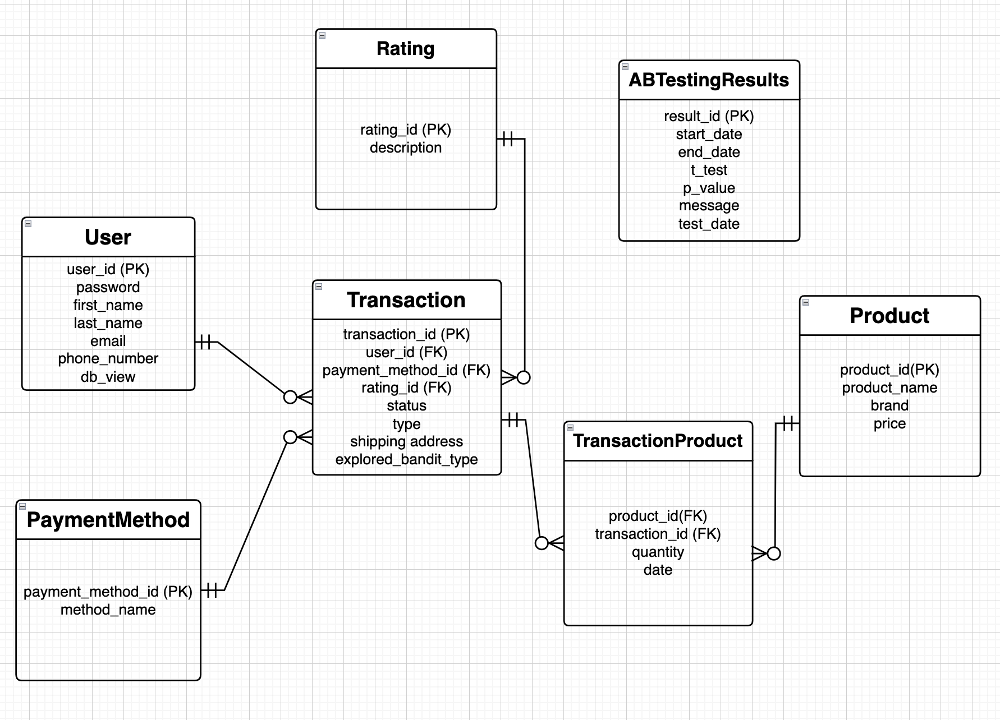

# Ecommerce Payment Optimizer
The Payment Optimizer package provides tools for analyzing and optimizing payment methods in e-commerce to maximize revenue generation. It includes A/B testing capabilities using t-tests to compare different payment options' effectiveness.

## Features
- A/B testing (t-test) functionality to evaluate the performance of different payment methods.
- Analysis tools to understand which payment options are more beneficial for e-commerce revenue.
- Integration with Power BI for visualization of test results through a dashboard.
- API for managing user registration, updating user information, adding transactions, and more.

## Subpackages
The payment_optimizer package consists of three essential subpackages:
- **db:** This subpackage facilitates various database operations, including generating fake data, writing data to CSV files, creating schemas, and generating the e_commerce.db file. Additionally, it provides functionalities for populating tables with generated data. The sql_interactions.py module serves as a bridge between SQL and Python, enabling seamless interactions between the two.
- **models:** In this subpackage, the necessary data is prepared, model metrics are created, and A/B testing is conducted for three payment options: only pre-payment is available, both pre and post-payment are available, and only post-payment is available. The results of the model are stored in a dictionary for further use.
- **api:** The API serves as the backend for the PayOpt application, providing endpoints for user authentication, product search, and additional functionalities for users with granted access and special permissions. It includes features such as user login, product search based on various criteria (product name, brand, price), and routers for handling endpoints specific to granted users and authentication requirements.


## Required Inputs
To utilize the package effectively, ensure that the schema adheres to the following format:



## Installation
You can install Payment Optimizer using pip:
```bash
pip install payment_optimizer
```

## Usage
Below is a basic example demonstrating how to utilize certain functions from the package:

```python
from payment_optimizer.models import ABTesting

ab_test = ABTesting(data_connect)
ab_test.preprocess_data()
model_result = ab_test.perform_ab_test(start_date, end_date)
```

## Documentation
For detailed documentation and usage examples, refer to the official [documentation](https://github.com/AregAmirjanyan/MarketingProject).  
Link to our Project in PyPi: [PyPi package:](https://pypi.org/project/new2/1.0.0/)

## License
Payment Optimizer is distributed under the MIT License.

